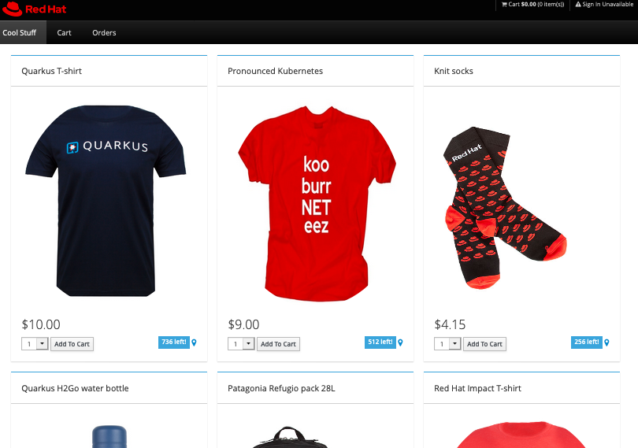

# Coolstore Jakarta EE

A sample application written as a Jakarta EE 8 app that can be deployed to EE compatible environments like Azure App Service with JBoss EAP.

### Docs

1. [JBoss EAP on Azure](https://docs.microsoft.com/azure/developer/java/ee/jboss-on-azure)
2. [Migrate JBoss EAP to Azure App Service](https://docs.microsoft.com/azure/developer/java/migration/migrate-jboss-eap-to-jboss-eap-on-azure-app-service?toc=/azure/developer/java/ee/toc.json&bc=/azure/developer/breadcrumb/toc.json)
3. [JBoss on App Service quickstart](https://aka.ms/jboss-quickstart)
4. [JBoss module on MS Learn](https://aka.ms/jakarta-ee)
